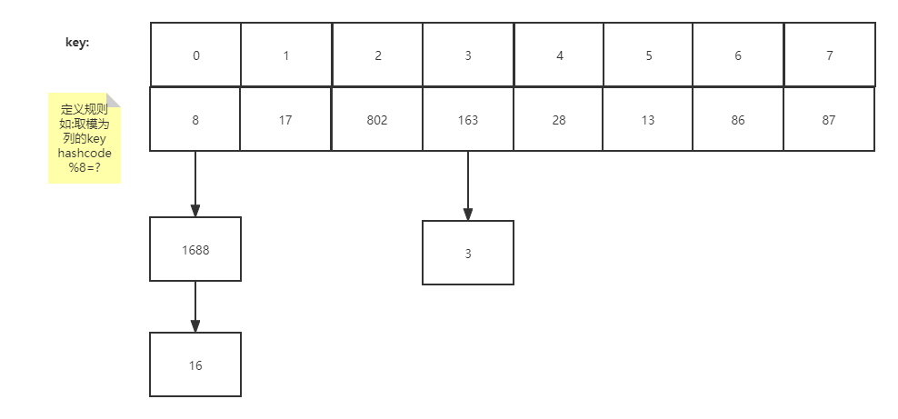

# 1. switch 支持类型

只支持byte,short,char,int,enum,String不支持long等其他

# 2. short s1 = 1;


# 3. /**wendan*/


# 4. &和&&区别

A&B A为false B依旧执行

A&&B A为false B就不执行了

```
i++ 先运算再加,++i
i = 1
int m = i++ + 2; // m = 3
int n = ++i + 2; // m = 4
```

& 还可以表示位运算，先转出二进制，再计算

```
1&3
```


# 5. final

以Math类为例

final修饰的类不可以被继承

final修饰的变量不可变，是指不可以改变引用，可以改变内容

final修饰的函数不能被重写


# 6. break;continue;return;


# 7. 结束多重循环

加标签

```
ok: for () {
	for () {
		if () {
			break ok;
		}
	}
}
```


# 8. java 面向对象特性

封装：提高对象安全性

继承：提高对象复用性

多态：提高对象扩展性；注意多态的话使用起来可能还不够使得代码最简洁，还得判断类型，最好的情况是使用反射；

# 9. 重载overload和重写override

重载发生在同一个类中，参数列表不同，重写发生在父子继承方法，参数列表相同，不能通过返回类型区分


# 10. ==和equals区别

==： 基础数据类型，比较的是值是否相等，引用数据类型，比较地址是否相等

equals: 没有重写则是等价于==，但一般重写之后，如String是比较内容是否相等


# 11. 交换

```
package org.javayyds.basic;

public class Changenum {

    /**
     * 不同方法不同的栈帧，如果要改变的话需要以数组的形势传递
     * @param args
     */
    public static void main(String[] args) {
        int a = 10;
        int b = 20;
        System.out.println("a:" + a + "; b:" + b);
        changeNum(a, b);
        System.out.println("a:" + a + "; b:" + b);
    }
    public static void changeNum(int a, int b) {
        int t = a;
        a = b;
        b = t;
    }
}

```


# 12. Comparable内部比较器、Comparator外部比较器

外部比较器，更好的复用，优势

```
package org.javayyds.basic;

import lombok.Data;

@Data
public class Student implements Comparable<Student> {

    private int age;

    public Student(int age) {
        this.age = age;
    }

    /**
     * 重写比较逻辑
     * @param o
     * @return
     */
    @Override
    public int compareTo(Student o) {
        return this.age - o.age;
    }
}

class StudentCompare {

    public static void main(String[] args) {
        Student s1 = new Student(10);
        Student s2 = new Student(28);
        System.out.println(s1.compareTo(s2));
    }
}
```

```
package org.javayyds.basic;

import lombok.Data;

import java.util.Comparator;

@Data
public class Student2 {

    private int age;

    public Student2(int age) {
        this.age = age;
    }
}

class BijiaoXuesheng implements Comparator<Student2> {

    @Override
    public int compare(Student2 o1, Student2 o2) {
        return o1.getAge() - o2.getAge();
    }
}

class StudentCompare2 {

    public static void main(String[] args) {
        Student2 s1 = new Student2(10);
        Student2 s2 = new Student2(28);
        Comparator comparator = new BijiaoXuesheng();
        System.out.println(comparator.compare(s1, s2));
    }
}

```


# 13. String s= "abc" 和String s = new String("abc")

```
package org.javayyds.basic;

public class StringTest {
    /**
     * s1和s2都是直接栈指向方法区
     * s3是指向new出来的堆内存，再指向方法区
     * s4是运行时编译，底层用的StringBuilder s.append s1, 然后append "",最后转成String
     * s5是跟s2一样，栈中直接指向方法区
     * @param args
     */
    public static void main(String[] args) {
        String s1 = "abc";
        String s2 = "a" + "bc";
        String s3 = new String("abc");
        String s4 = s1 + "";
        String s5 = "abc" + "";

        // TODO: 2021/12/31 如何获取string变量的地址

        System.out.println("s1:" + s1.hashCode());
        System.out.println("s2:" + s2.hashCode());
        System.out.println("s3:" + s3.hashCode());
        System.out.println("..");
    }
}

```


# 14. String, StringBuffer, StringBuilder，底层都是数组

```
package org.javayyds.basic;

/**
 * 1. String, 创建之后，包含在这个对象中的字符串是不可变的
 * 2. StringBuffer, 序列可变, 直到生成最后的string, toString方法
 * 3. StringBuilder, 一般默认采用这个，效率比上者更高，但是线程不安全，StringBuffer是安全的,
 */
public class StringBuilderTest {
    public static void main(String[] args) {
        String s = new String("abc");
        StringBuffer sbf = new StringBuffer("abc");
        sbf.append("e");
        sbf.insert(1, "f");
        StringBuilder sbd = new StringBuilder("abc");

    }
}

```


# 15. int 和 Integer区别

```
package org.javayyds.basic;

/**
 * Integer 包装类, 出了value方法等于int值,还封装了其他方法,自动拆箱
 */
public class IntegerTest {

    public static void main(String[] args) {
        Integer integer = new Integer(888);
        int i = 888;
        System.out.println(integer.intValue());
        System.out.println(integer.floatValue());
    }
}

```


# 16. Java里的异常关键字

```
package org.javayyds.basic;

public class ExceptionTest {

    public static void main(String[] args) {
        try {
            // 执行网络连接,数据库连接
            // 代码逻辑
            eat2();
        } catch (Exception e) {
            // 捕获异常
        } finally {
            // 如果有网络连接,数据库连接 需要进行回收
        }
        eat();
    }

    private static void eat() {
        // throw 抛出异常
        throw new RuntimeException();
    }

    // throws 声明异常
    private static void eat2() throws Exception {
        throw new Exception();
    }
}

```


# 17. Java单继承,多实现接口

多实现接口方法不会冲突,多继承会冲突

```
package org.javayyds.basic;

/**
 * 子类如果能继承多个父类，如果多个父类中存在同名属性或者方法，
 * 子类继承时将不能判断继承自哪个父类的属性和方法，所以类之间不能多继承
 *
 * 接口中的方法均为抽象方法，没有具体实现的方法体，所以在多继承的情况下，
 * 即使方法同名，也不会出现类多继承那样的矛盾
 */
public class InterfaceTest extends Student implements Comparable, Cloneable {

    public InterfaceTest(int age) {
        super(age);
    }

    @Override
    public int compareTo(Object o) {
        return 0;
    }
}

```


# 18. 容器

1. 容器框架的必要性:
2. 层级: 
3. JUC: java.util.concurrent; 解决Java并发问题的包,代表 LinkedBlockingQueue<E>
4. 多使用[官方文档](https://docs.oracle.com/javase/8/docs/api/) 查询
5. 加.var后缀可以快速补全

## 18.1 Collection: (无序,不唯一)

```java
package org.javayyds.container;

import java.util.ArrayList;
import java.util.Collection;

/**
 * 特点：
 * 1. 可以存放不同数据类型,而数组只能存放同一种数据类型
 * 2. 可以自动扩容,初始的容量是10, 每次扩容是变成原来oldCapacity的1.5倍
 *
 * api:
 * 1. add: 要求传入Object对象, 因此传入基本类型时包含了自动拆箱装箱过程
 * 2. addAll: 把另一个集合添加到该集合内
 * 3. clear: 清空集合内的元素,但该集合并没有被回收
 * 4. contains: 集合中是否包含该元素
 * 5. containsAll:是否包含另一个集合的所有元素,有一个没有就返回false
 * 6. equals: 相同的元素,相同的顺序
 * 7. parallelStream
 * 8. remove: 删除某个元素
 * 9. removeAll: 删除某些元素
 * 10. removeif: 删除符合条件的元素
 * 11. isEmpty: 集合是否为空
 * 12. retainAll: 包含集合的所有元素
 * 13. size: 集合大小
 * 14. toArray: 转为数组
 */
public class CollectionDemo {
    public static void main(String[] args) {
        // 接口是不能实例化的，所以new子类
        Collection collection = new ArrayList();
        collection.add(1);
        collection.add(true);
        collection.add(1.33354);
        collection.add("test");
        System.out.println(collection);
        ((ArrayList) collection).add(0, "insert");
        System.out.println(collection);
        Collection collection1 = new ArrayList();
        collection1.add("aaa");
        collection1.add("bbb");
        collection1.add("cc");
        collection1.add("dd");
        collection.addAll(collection1);
        System.out.println(collection);
        System.out.println(collection.contains("aaa"));
        System.out.println(collection.contains(collection1));
        System.out.println(collection.containsAll(collection1));
        System.out.println("collection 包含所有collection1的元素" + collection.retainAll(collection1));
        System.out.println("collection1 包含所有collection的元素" + collection1.retainAll(collection));
        System.out.println(collection.size());
        Object[] objects = collection.toArray();
        collection.remove("bbb");
        System.out.println(collection);
        collection.clear();
        System.out.println(collection);
        System.out.println(collection.contains("aaa"));
        System.out.println(collection.contains(collection1));
        System.out.println(collection.containsAll(collection1));

    }
}
```

输出:

```
[1, true, 1.33354, test]
[insert, 1, true, 1.33354, test]
[insert, 1, true, 1.33354, test, aaa, bbb, cc, dd]
true
false
true
collection 包含所有collection1的元素true
collection1 包含所有collection的元素false
4
[aaa, cc, dd]
[]
false
false
false

Process finished with exit code 0

```


## 18.2 List (有序,不唯一)

```java
package org.javayyds.container;

import java.util.ArrayList;
import java.util.List;

public class ListDemo {
    public static void main(String[] args) {
        List list = new ArrayList();
        list.add("a");
        list.add(true);
        list.add(1);
        list.add("a");
        list.add(1.33);
        System.out.println(list);

        System.out.println(list.get(0));
        System.out.println(list.indexOf("a"));
        System.out.println(list.lastIndexOf("a"));

        System.out.println(list.set(1, "b"));
        System.out.println(list);

        System.out.println(list.subList(2,4));

        List list1 = List.of(1, 2, 4, 6);
        System.out.println(list1);
    }
}

```

输出:

```
[a, true, 1, a, 1.33]
a
0
3
true
[a, b, 1, a, 1.33]
[1, a]
[1, 2, 4, 6]
```


## 18.3  List接口的实现类

### 18.3.1 ArrayList

底层数据结构用的是数组,连续的内存空间进行元素存储

优点是,遍历和随机访问效率比较高

缺点是,增加删除和按内容查询效率低

适合查询比较频繁的集合选择

### 18.3.2 LinkedList

底层用的是链表结构,有前驱后继,非连续存储空间

优点是,增加和删除效率高,只要改变某两个节点的前驱或后继

缺点是,遍历和随机访问效率低

适合修改比较频繁的集合选择

提供丰富的API, 使用的时候查询[官方文档](https://docs.oracle.com/en/java/javase/17/docs/api/java.base/java/util/Collection.html)即可

```
package org.javayyds.container;

import java.util.LinkedList;

/**
 * LinkedList
 * 提供丰富的API, 使用的时候查询官方文档即可
 * https://docs.oracle.com/en/java/javase/17/docs/api/java.base/java/util/Collection.html
 */
public class LinkedListDemo {
    public static void main(String[] args) {
        LinkedList list = new LinkedList();
        list.add("a");
        list.add(true);
        list.add(1);
        list.add(1.234);
        System.out.println(list);

        list.add(3, "c");
        System.out.println(list);
        list.add(3, "d");
        System.out.println(list);

        list.addFirst("111");
        System.out.println(list);
        list.addLast("222");
        System.out.println(list);

        System.out.println(list.peek());
        System.out.println(list);
        System.out.println(list.peekFirst());
        System.out.println(list);
        System.out.println(list.peekLast());
        System.out.println(list);
        System.out.println(list.poll());
        System.out.println(list);
        System.out.println(list.pollFirst());
        System.out.println(list);
        System.out.println(list.pollLast());
        System.out.println(list);

    }
}

```

输出:

```
[a, true, 1, 1.234]
[a, true, 1, c, 1.234]
[a, true, 1, d, c, 1.234]
[111, a, true, 1, d, c, 1.234]
[111, a, true, 1, d, c, 1.234, 222]
111
[111, a, true, 1, d, c, 1.234, 222]
111
[111, a, true, 1, d, c, 1.234, 222]
222
[111, a, true, 1, d, c, 1.234, 222]
111
[a, true, 1, d, c, 1.234, 222]
a
[true, 1, d, c, 1.234, 222]
222
[true, 1, d, c, 1.234]

Process finished with exit code 0

```

###  18.3.3 Vector

```java
package org.javayyds.container;

import java.util.Vector;

/**
 * Vector
 * 1. List接口的子类,
 * 2. 跟ArrayList一样底层也是数组
 * 3. 面试常问:
 *      ArrayList是线程不安全,效率高; Vector 是加了synchronized,线程安全,效率低
 *      ArrayList扩容grow操作是扩容为原来的1.5倍,Vector扩容为原来的2倍
 */
public class VectorDemo {
    public static void main(String[] args) {
        Vector vector = new Vector();
        vector.add("a");
        vector.add(true);
        vector.add(1);
        vector.add(1.233);
        System.out.println(vector);

    }
}

```

输出:

```
[a, true, 1, 1.233]
```


## 18.4 Iterator

```java
package org.javayyds.container;

import java.util.*;

/**
 * 常用的循环方式
 * do...while
 * while
 * for
 * 循环增强
 *
 * 增强for循环本质上也是使用一个iterator
 *
 * 1. 所有集合类都默认实现了Iterable接口,实现该接口意味着具备了增强for循环
 * 增强for循环本质上使用的是iterator功能
 * 方法:
 * iterator
 * foreach
 *
 * 2. iterator方法中,要求返回一个Iterator的接口子类内部类实例
 * 此接口中包含
 * hasNext()
 * next()
 *
 * 3. 如果循环遍历时需要对数据进行删除,会发生并发修改异常,
 * 因此遍历的同时需要修改数据,则应该使用listIterator()方法
 *
 * listIterator提供向前遍历和向后遍历两种
 * 始终通过cursor和lastret指针来获取元素值以及向下遍历索引
 * 
 *
 *
 */
public class IteratorDemo {
    public static void main(String[] args) {
        List list = new ArrayList();
        list.add(1);
        list.add(2);
        list.add(3);
        list.add(4);
        for (int i = 0; i < list.size(); i++) {
            System.out.println(list.get(i));
        }

        // 迭代器
        Iterator iterator = list.iterator();
        while (iterator.hasNext()) {
            System.out.println(iterator.next());
        }

        // 循环增强
        for (Object s : list) {
            System.out.println(s);
        }
        try {
//            while (iterator.hasNext()) {
//                Object item = iterator.next();
//                if (item.equals(1)) {
//                    iterator.remove();
//                }
//            }
            for (Object o : list) {
                Object item = o;
                if (item.equals(1)) {
                    list.remove(item);
                }
            }
        } catch(ConcurrentModificationException e) {
            System.out.println("remove error");
        }
        System.out.println(list);
        System.out.println("-------------------");
        List list2 = new ArrayList();
        list2.add(1);
        list2.add(2);
        list2.add(3);
        list2.add(4);
        ListIterator listIterator = list2.listIterator();
        try {
            while (listIterator.hasNext()) {
                Object item = listIterator.next();
                if (item.equals(1)) {
                    listIterator.remove();
                }
            }
        } catch(ConcurrentModificationException e) {
            System.out.println("remove error2");
        }
        System.out.println(list2);

        // 此时cursor游标在最下边的index,所以可以倒序遍历
        while (listIterator.hasPrevious()) {
            System.out.println(listIterator.previous());
        }

    }
}

```

输出:

```
1
2
3
4
1
2
3
4
1
2
3
4
remove error
[2, 3, 4]
-------------------
[2, 3, 4]
4
3
2

Process finished with exit code 0
```

## 18.5 Test

Dog:

```java
package org.javayyds.container;

import java.util.Objects;

public class Dog {

    private String name;
    private String color;

    public Dog() {
    }

    public Dog(String name, String color) {
        this.name = name;
        this.color = color;
    }

    @Override
    public boolean equals(Object o) {
        if (this == o) return true;
        if (o == null || getClass() != o.getClass()) return false;
        Dog dog = (Dog) o;
        return name.equals(dog.name) && color.equals(dog.color);
    }

    @Override
    public int hashCode() {
        return Objects.hash(name, color);
    }

    @Override
    public String toString() {
        return "Dog{" +
                "name='" + name + '\'' +
                ", color='" + color + '\'' +
                '}';
    }
}

```

DogTest:

```java
package org.javayyds.container;

import java.util.ArrayList;
import java.util.List;

public class DogTest {

    public static void main(String[] args) {
        Dog d1 = new Dog("旺1", "白色");
        Dog d2 = new Dog("旺2", "黑色");
        Dog d3 = new Dog("旺3", "黄色");
        List list = new ArrayList();
        list.add(d1);
        list.add(d2);
        list.add(d3);

        /**
         * 改写toString 方法才会打印内容
         */
        System.out.println(list);

        list.remove(d2);
        System.out.println(list);

        System.out.println(list.contains(d2));
        System.out.println(list.contains(d1));

        Dog d4 = new Dog("旺1", "白色");
        /**
         * 改写equals方法才会是true,即通过内容判断,不然判断的是地址,新new出来的地址不一样
         */
        System.out.println(list.contains(d4));

    }
}

```

输出:

```
[Dog{name='旺1', color='白色'}, Dog{name='旺2', color='黑色'}, Dog{name='旺3', color='黄色'}]
[Dog{name='旺1', color='白色'}, Dog{name='旺3', color='黄色'}]
false
true
true

Process finished with exit code 0

```

## 18.6 Set (无序,唯一)

底层是HashMap散列表结构




