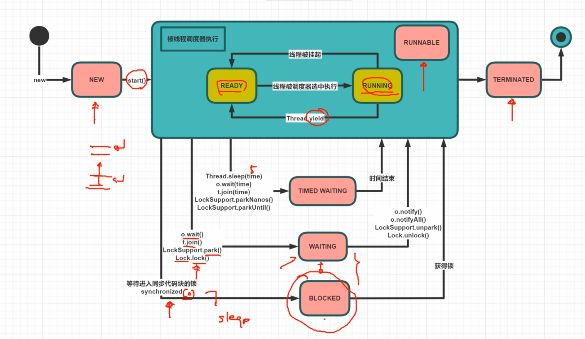

# 1. 什么是线程、进程

程序：可执行文件

进程：资源分配的最小单位，一个程序多次执行可以产生多个进程

线程：进程内资源调度的最小单位

纤程/协程：绿色线程，由用户控制不由OS控制


# 2. CPU内部结构

ALU ：计算

Register 寄存器： 存储数据

PC ：存储指令


# 3. 单线程有必要开多个线程吗

有意义，因为单个线程中有可能存在获取其他网络资源之类的非CPU工作耗时，这种情况下可以切到另一个线程


# 4. 工作线程是不是设置得越大越好

不是，OS调度切换线程也会消耗资源，应当设置一个合适的数值


# 5. 如何确定合适的线程数

目标线程数 = CPU数量 * CPU预期利用率 * (1 + 线程等待时间 / 线程计算时间)

如何知道 线程等待时间 和 线程计算时间， 只能部署之后，日志分析得出，压力测试得到

工具可以使用：Profiler ，Java使用JProfiler， 如果部署到了远程了，可以使用Arthas


# 6. 创建线程的5种方式

```java
package org.javayyds.multithread;

import java.util.concurrent.*;

public class HowToCreateThread {

    static class MyThread extends Thread {

        @Override
        public void run() {
            System.out.println("Hello MyThread");
        }
    }

    static class MyRunnable implements Runnable {

        @Override
        public void run() {
            System.out.println("Hello MyRunnable");
        }
    }

    static class MyCallable implements Callable<String> {

        @Override
        public String call() throws Exception {
            System.out.println("Hello MyCallable");
            return "success";
        }
    }

    // 5种方式
    public static void main(String[] args) throws ExecutionException, InterruptedException {
        new MyThread().start();
        // implements 更好因为不像extend只能继承一个
        new Thread(new MyRunnable()).start();
        new Thread(() -> {
            System.out.println("Hello Lambda");
        }).start();

        // 不使用线程池，也可以有返回值，使用FutureTask
        FutureTask<String> futureTask = new FutureTask<>(new MyCallable());
        Thread t = new Thread(futureTask);
        t.start();
        String ft = futureTask.get();
        System.out.println(ft);

        ExecutorService service = Executors.newCachedThreadPool();
        service.execute(() -> {
                System.out.println("Hello ThreadPool");
            }
        );

        Future<String> f = service.submit(new MyCallable());

        // get() 是阻塞类型的方法，意味着需要执行完拿到返回值才往下走
        String s = f.get();
        System.out.println(s);
    }
}

```

output:

```
Hello MyThread
Hello MyRunnable
Hello Lambda
Hello MyCallable
success
Hello ThreadPool
Hello MyCallable
success
```


# 7. 线程的六种状态

NEW

RUNNABLE (READY/RUNNING)

BLOCKED

TIMEWAITING

WAITING

TERMINATED



```java
package org.javayyds.multithread;

import java.util.concurrent.locks.Lock;
import java.util.concurrent.locks.LockSupport;
import java.util.concurrent.locks.ReentrantLock;

public class ThreadState {

    public static void main(String[] args) throws InterruptedException {
        // ==========================================
        Thread t1 = new Thread(() -> {
            System.out.println("2:" + Thread.currentThread().getState());
            for (int i = 0; i < 3; i++) {
                SleepHelper.sleepSeconds(1);
                System.out.print(i + " ");
            }
            System.out.println();
        });
        System.out.println("1:" + t1.getState());
        t1.start();
        t1.join();
        System.out.println("3:" + t1.getState());

        // ==========================================
        Thread t2 = new Thread(() -> {
            // 等待被叫醒
            LockSupport.park();
            System.out.println("t2 go on");
            SleepHelper.sleepSeconds(5);
        });

        t2.start();
        SleepHelper.sleepSeconds(1);
        // 睡一秒是为了确保等到时间片切到t2线程，不然还没执行到LockSupport.park();获取到的就是RUNNABLE了
        System.out.println("4:" + t2.getState());

        LockSupport.unpark(t2);
        // 确保上边执行完叫醒t2
        SleepHelper.sleepSeconds(1);
        System.out.println("5:" + t2.getState());

        // ==========================================
        final Object o = new Object();
        Thread t3 = new Thread(() -> {
            synchronized (o) {
                System.out.println("t3 竞争到锁 o");
            }
        });

        new Thread(() -> {
            synchronized (o) {
                SleepHelper.sleepSeconds(5);
            }
        }).start();

        t3.start(); // start 之后跟一个主线程sleep确保t3线程执行完成
        SleepHelper.sleepSeconds(1);
        System.out.println("6:" + t3.getState());

        Lock lock = new ReentrantLock();
        Thread t4 = new Thread(() -> {
            lock.lock();
            System.out.println("t4 竞争到了JUC锁 lock");
            lock.unlock();
        });

        new Thread(() -> {
            lock.lock();
            SleepHelper.sleepSeconds(5);
            lock.unlock();
        }).start();

        t4.start();
        SleepHelper.sleepSeconds(1);
        System.out.println("7:" + t4.getState());

        //WAITING状态，只有synchronized才会导致BLOCKED,因为会进入OS控制
        Thread t5 = new Thread(() -> {
            LockSupport.park();
        });

        t5.start();
        SleepHelper.sleepSeconds(1);

        System.out.println("8:" + t5.getState());
        LockSupport.unpark(t5);
    }
}

```

```java
package org.javayyds.multithread;

import java.util.concurrent.TimeUnit;

public class SleepHelper {

    public static void sleepSeconds(int second) {
        try {
            TimeUnit.SECONDS.sleep(second);
        } catch (InterruptedException e) {
            e.printStackTrace();
        }
    }
}

```


output:

```
1:NEW
2:RUNNABLE
0 1 2 
3:TERMINATED
4:WAITING
t2 go on
5:TIMED_WAITING
6:BLOCKED
7:WAITING
8:WAITING
t3 竞争到锁 o
t4 竞争到了JUC锁 lock
```


# 8. 打断

interrupt() 打断某个线程，给线程设置标志位false变成true，使用t.interrupt()

isInterrupted() 查询某个线程是否被打断过，查询标志位，使用 t.isInterrupted()

static interrupted() 查询当前线程是否被打断过，并重置打断标志位为false
